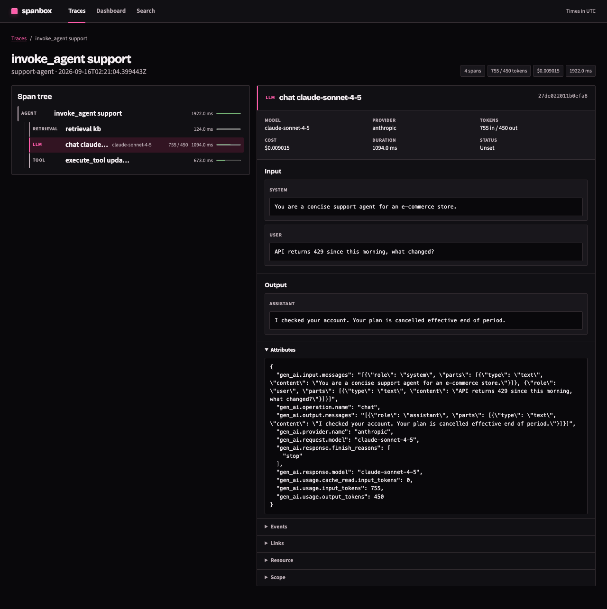
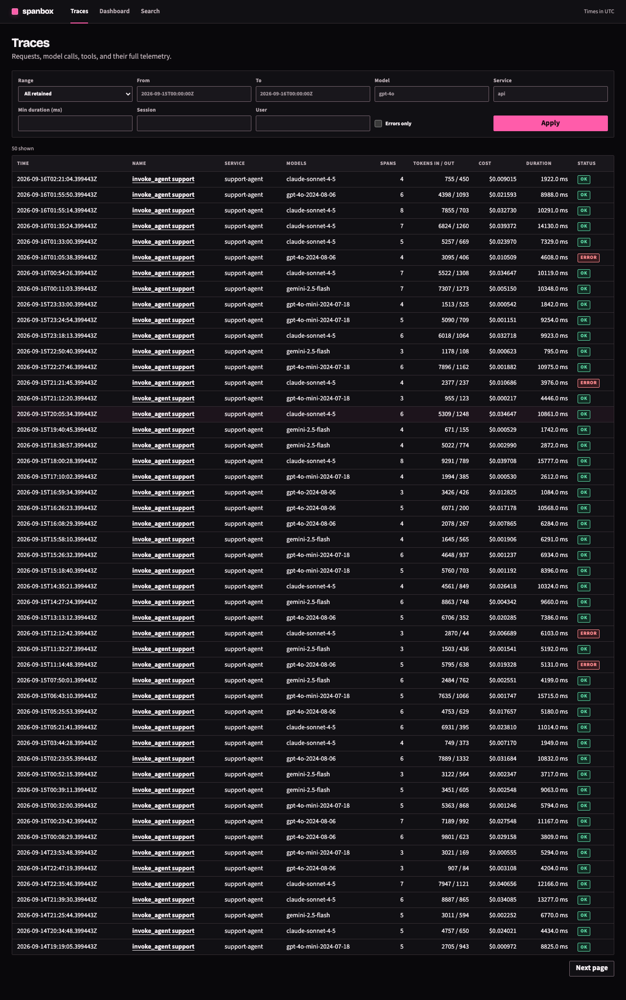
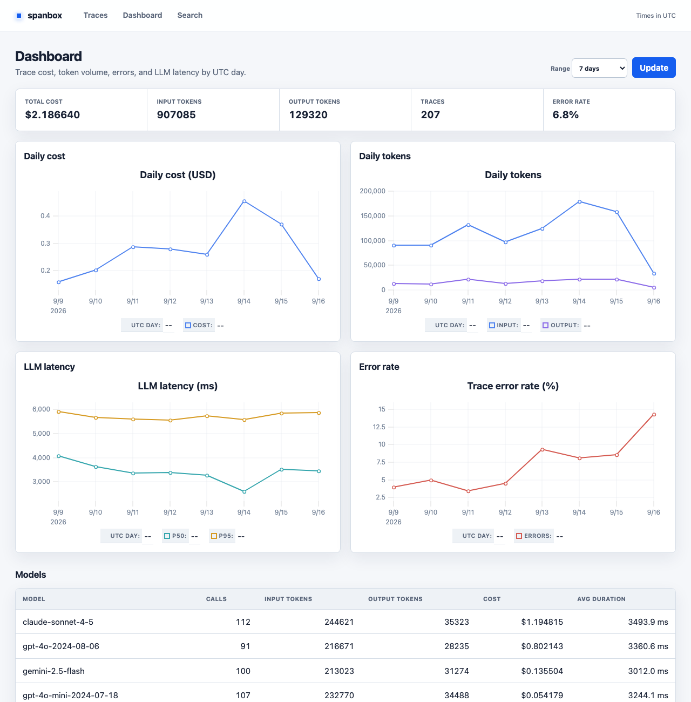

# spanbox

spanbox is a single-binary OpenTelemetry trace monitor for LLM applications. It accepts OTLP/HTTP protobuf or JSON on port 4318, stores complete span data in embedded SQLite, and serves trace, token, cost, latency, search, and read-only SQL views from the same port—without Postgres, ClickHouse, Redis, or object storage.



<details>
<summary>More screenshots: trace list and dashboard</summary>




</details>

## Install

Download a binary from the [releases page](https://github.com/Ray0907/spanbox/releases), or use the container image below. There are no required environment variables; run `./spanbox` and open http://localhost:4318.

## Run with Docker

Generate a token with at least 32 cryptographically random bytes, then start spanbox:

```sh
docker run -p 4318:4318 -v ./data:/data -e AUTH_TOKEN=$(openssl rand -hex 32) ghcr.io/ray0907/spanbox
```

For a bind mount, create the directory first and restrict it to the container user (for example, `mkdir -m 700 data`). spanbox warns when an existing data directory is accessible by group or other users. The database file is created with mode `0600`.

## Configuration

All configuration is optional.

| Environment variable | Default | Description |
|---|---:|---|
| `PORT` | `4318` | HTTP listen port on all interfaces |
| `DATA_DIR` | `./data` | Directory containing `spanbox.db` |
| `RETENTION_DAYS` | `30` | Delete complete traces older than this; `0` disables retention |
| `AUTH_TOKEN` | empty | Bearer token for ingest and login token for the UI |
| `PRICING_FILE` | empty | Replacement LiteLLM model pricing JSON file |

Without `AUTH_TOKEN`, ingest and the UI are open and the SQL console is disabled.

## Export traces

### Python OpenTelemetry

```sh
export OTEL_EXPORTER_OTLP_ENDPOINT=http://localhost:4318
export OTEL_EXPORTER_OTLP_HEADERS="Authorization=Bearer <token>"
export OTEL_EXPORTER_OTLP_PROTOCOL=http/protobuf
export OTEL_INSTRUMENTATION_GENAI_CAPTURE_MESSAGE_CONTENT=SPAN_AND_EVENT
```

Use these variables with the standard OTLP HTTP exporter and your OpenTelemetry instrumentation. The official `opentelemetry-instrumentation-google-genai` requires `SPAN_AND_EVENT`; it rejects `true` and falls back to capturing no message content. Other GenAI instrumentations commonly accept `true` instead.

### Gemini CLI

```json
// ~/.gemini/settings.json
{
  "telemetry": {
    "enabled": true,
    "target": "local",
    "otlpEndpoint": "http://localhost:4318",
    "otlpProtocol": "http",
    "logPrompts": true,
    "useCollector": false
  }
}
```

Gemini CLI reports model calls as OpenTelemetry GenAI log events. spanbox turns each call into an `llm` span and groups calls into one trace per CLI session; metrics are accepted and discarded. `POST /` detects JSON signals, but treats protobuf as traces; send protobuf logs to `/v1/logs`.

Gemini CLI 0.26.0 HTTP telemetry has no setting equivalent to `otlpHeaders`, and its OTLP exporters are constructed without headers, so it cannot send the Bearer header required by `AUTH_TOKEN` today. Use an OTLP collector or reverse proxy that adds the header when authentication is required.

### Langfuse Python SDK (v3 and v4)

Pass spanbox as the SDK's OpenTelemetry exporter. Verified with langfuse 4.15.3: `generation`, `agent`, and `tool` observations, `usage_details` (including `input_cached_tokens`), `cost_details`, and `propagate_attributes(session_id=..., user_id=...)` all map to spanbox columns.

```python
from langfuse import Langfuse
from opentelemetry.exporter.otlp.proto.http.trace_exporter import OTLPSpanExporter

langfuse = Langfuse(
    span_exporter=OTLPSpanExporter(
        endpoint="http://localhost:4318/v1/traces",
        headers={"Authorization": "Bearer <token>"},
    )
)
```

### Vercel AI SDK

Register AI SDK telemetry, then send it through the standard OTLP HTTP exporter:

```ts
import { registerTelemetry } from "ai";
import { OpenTelemetry } from "@ai-sdk/otel";
import { NodeSDK } from "@opentelemetry/sdk-node";
import { OTLPTraceExporter } from "@opentelemetry/exporter-trace-otlp-http";

registerTelemetry(new OpenTelemetry());

const sdk = new NodeSDK({
  traceExporter: new OTLPTraceExporter({
    url: "http://localhost:4318/v1/traces",
    headers: { Authorization: "Bearer <token>" },
  }),
});
sdk.start();
```

Enable telemetry on AI SDK calls as documented for the SDK version you use.

### Verified end to end

`examples/otel-python/emit.py` drives the real OpenTelemetry Python SDK (OTLP protobuf, gzip, batch export) against a running spanbox and produces agent, chat, and tool spans with token usage and cache reads:

```sh
pip install opentelemetry-sdk opentelemetry-exporter-otlp-proto-http
SPANBOX_URL=http://localhost:4318 AUTH_TOKEN=<token> python examples/otel-python/emit.py 100
```

On a laptop, 9,000 spans sent in one burst land in SQLite in under two seconds. If the SDK logs that its queue is full, raise `max_queue_size` on `BatchSpanProcessor`; the default of 2048 drops spans under bursts before they reach spanbox.

## SQL console security

`/sql` is available only when `AUTH_TOKEN` is set and only to an authenticated UI session. Queries run through a read-only SQLite connection with `query_only`, a tokenizer guard, a 5-second timeout, and strict result limits. SQLite's Go driver does not expose an engine-level authorizer, so this console is for trusted operators holding the token—not untrusted users.

## Update model pricing

The embedded pricing table is LiteLLM's `model_prices_and_context_window.json`:

```sh
curl -o internal/pricing/model_prices.json https://raw.githubusercontent.com/BerriAI/litellm/main/model_prices_and_context_window.json
```

Rebuild spanbox after updating the file.

## Build from source

```sh
go build -ldflags "-s -w -X main.version=$(git describe --tags --always)" ./cmd/spanbox
```

The project builds with `CGO_ENABLED=0`.
