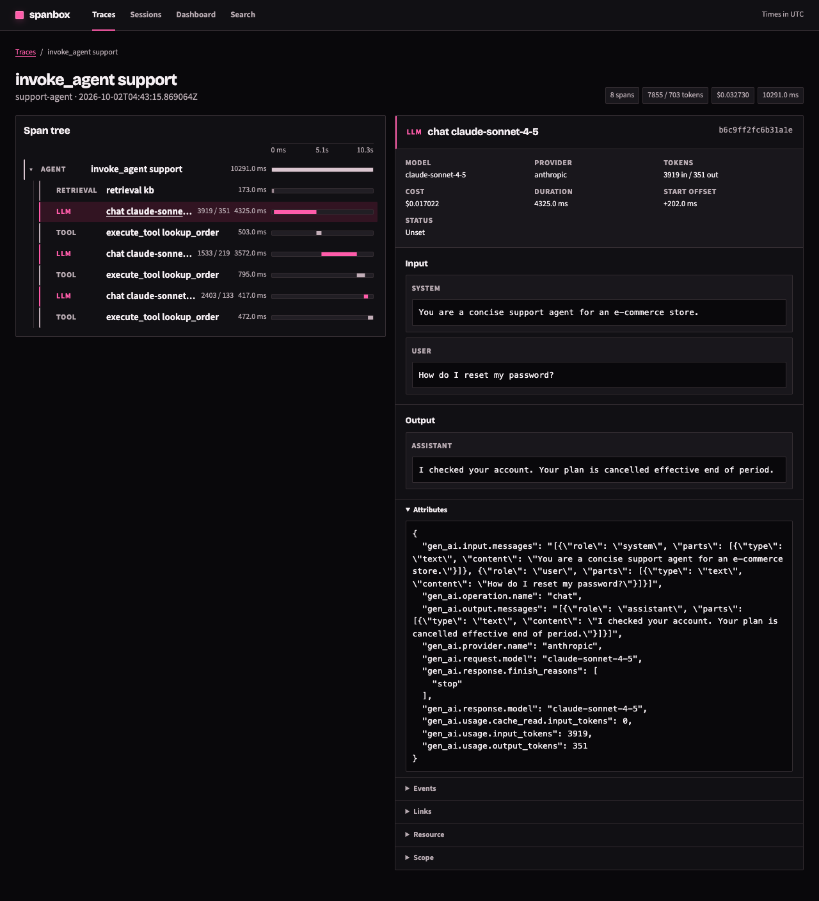
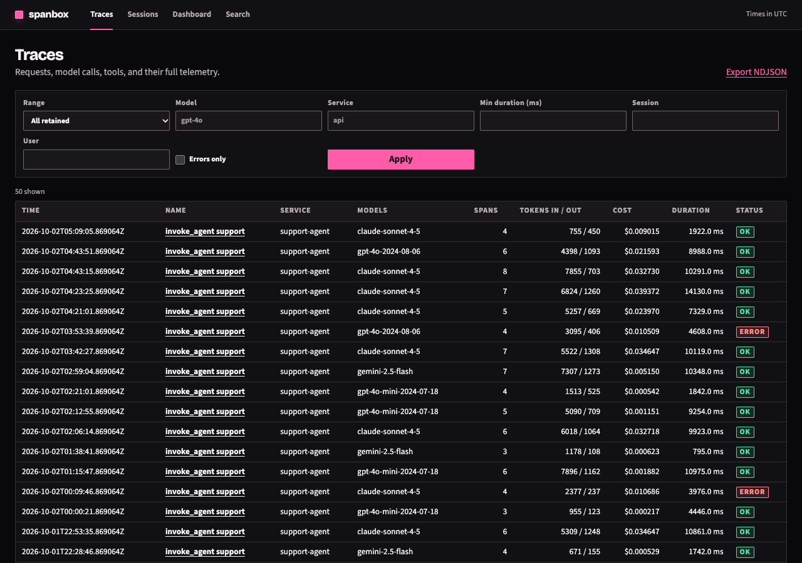
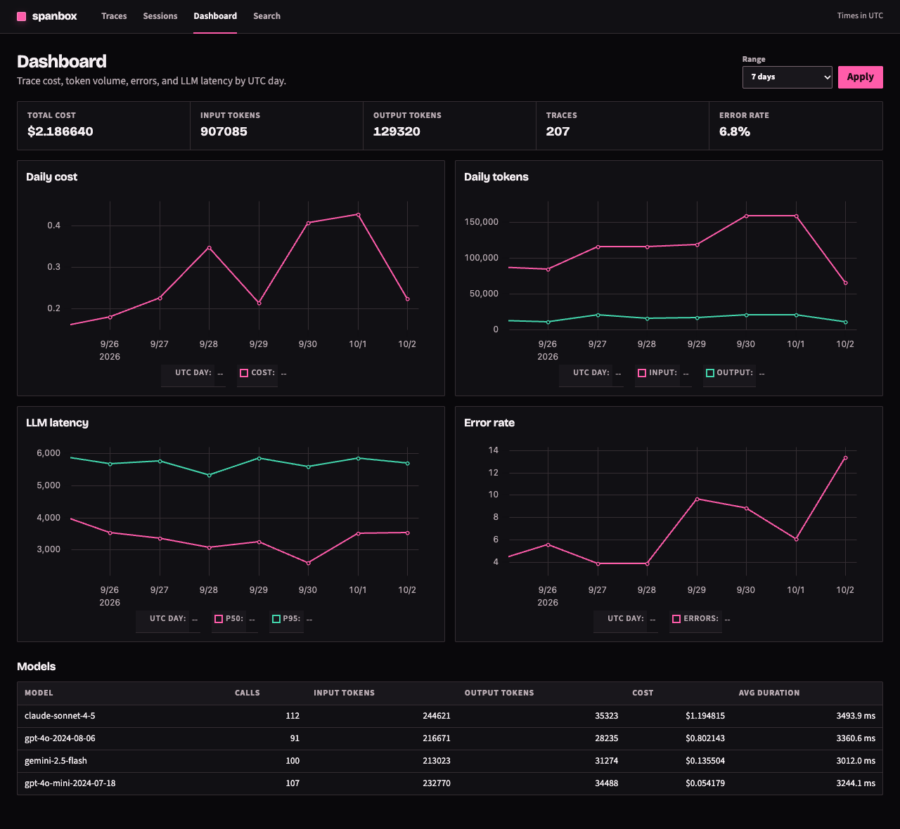

# spanbox

spanbox is a single-binary OpenTelemetry trace monitor for LLM applications. It accepts OTLP/HTTP protobuf or JSON on port 4318, stores complete span data in embedded SQLite, and serves trace, token, cost, latency, search, and read-only SQL views from the same port—without Postgres, ClickHouse, Redis, or object storage.



<details>
<summary>More screenshots: trace list and dashboard</summary>




</details>

## Install

Download a binary from the [releases page](https://github.com/Ray0907/spanbox/releases), or use the container image below. There are no required environment variables; run `./spanbox` and open http://localhost:4318.

### Supported platforms

Release binaries support **Linux amd64/arm64** (including Arch Linux and Arch-based Omarchy; AUR package [`spanbox-bin`](deploy/aur/PKGBUILD)), **macOS amd64/arm64**, and **Windows amd64**. On Windows, run `.\spanbox.exe` from PowerShell.

[CI](.github/workflows/ci.yml) exercises Ubuntu amd64, an Arch Linux amd64 container, and Windows amd64 with Go vet, race-enabled tests and builds. Arch and Windows also run the full export/import round trip; Windows additionally launches the pure-Go release-style executable, ingests one OTLP span, reads it over HTTP and terminates it. The Arch container represents Omarchy's base distribution, not its desktop setup or AUR installation. Linux arm64 and macOS are published build targets, not runtime-tested by this CI workflow.

**Windows limitations:** protect `DATA_DIR` with Windows ACLs; POSIX 0600/0700 permission bits do not describe Windows access. Automated child-process cleanup uses forced termination because Go cannot send `os.Interrupt` to a Windows subprocess. CI proves process termination and data round trips, **not graceful Windows shutdown**; all other E2E assertions still run.

## Run with Docker

Generate a token with at least 32 cryptographically random bytes, then start spanbox:

```sh
docker run -p 4318:4318 -v ./data:/data -e AUTH_TOKEN=$(openssl rand -hex 32) ghcr.io/ray0907/spanbox
```

For a bind mount, create the directory first and restrict it to the container user (for example, `mkdir -m 700 data`). spanbox warns when an existing data directory is accessible by group or other users. The database file is created with mode `0600`.

## Configuration

All configuration is optional.

| Environment variable | Default | Description |
|---|---:|---|
| `PORT` | `4318` | HTTP listen port on all interfaces |
| `DATA_DIR` | `./data` | Directory containing `spanbox.db` |
| `RETENTION_DAYS` | `30` | Delete complete traces older than this; `0` disables retention |
| `PURGE_BATCH_SIZE` | `10` | Complete traces per retention delete transaction; integer 1–200 |
| `FTS_MERGE_EVERY` | `256` | Delete batches per explicit FTS merge step; integer 1–1024; automatic merges remain enabled |
| `AUTH_TOKEN` | empty | Bearer token for ingest and login token for the UI |
| `PRICING_FILE` | empty | Replacement LiteLLM model pricing JSON file |
| `ANTHROPIC_UPSTREAM` | `https://api.anthropic.com` | Anthropic proxy upstream override |
| `OPENAI_UPSTREAM` | `https://api.openai.com` | OpenAI proxy upstream override |
| `OPENAI_COMPAT_UPSTREAMS` | empty | Named OpenAI-compatible upstreams as `name=url,name2=url2` |
| `CHATGPT_UPSTREAM` | `https://chatgpt.com/backend-api` | ChatGPT-authenticated Codex proxy upstream override |
| `GEMINI_UPSTREAM` | `https://generativelanguage.googleapis.com` | Gemini proxy upstream override |

Without `AUTH_TOKEN`, ingest and the UI are open and the SQL console is disabled.

The upstream URL defaults above are applied by the proxy; `config.FromEnv` leaves unset upstream overrides empty.

## HTTP routes and authentication

When `AUTH_TOKEN` is unset, these routes require no authentication (except `/sql`, which is disabled). When it is set:

| Route | Authentication and behavior |
|---|---|
| `GET /healthz`, `GET /api/public/health` | Public health checks; no token required |
| `/login`, `/static/` | Public login form and static assets; `POST /login` exchanges the token for a session cookie |
| `POST /`, `POST /v1/traces`, `POST /v1/logs`, `POST /v1/metrics` | Require `Authorization: Bearer <AUTH_TOKEN>`; metrics are accepted and discarded |
| `POST /api/public/otel/v1/traces` | Requires Bearer auth or Basic auth with `AUTH_TOKEN` as the password; the username is ignored |
| `GET /`, `/sessions`, `/search`, `/traces/`, `/spans/` | HTML pages require a login cookie (otherwise redirect to `/login`); `?format=json` also accepts Bearer auth and returns JSON 401 when unauthorized |
| `/dashboard` | Requires a login cookie; otherwise redirects to `/login` |
| `/dashboard/data` | Accepts Bearer auth or a login cookie; returns JSON 401 when unauthorized |
| `/sql` | Requires a login cookie; Bearer auth alone does not grant access |
| `GET /export` | Streams spans as `application/x-ndjson`, using the trace-list filters; requires Bearer auth or a login cookie, otherwise 401 |
| `POST /import` | Accepts `application/x-ndjson` span records and returns an imported count; requires Bearer auth or a login cookie, otherwise 401 |
| `/proxy/` | `/proxy/anthropic/...`, `/proxy/openai/...`, `/proxy/chatgpt/...` (Codex inference: `POST /proxy/chatgpt/codex/responses`), `/proxy/gemini/...`, and `/proxy/openai-compat/<name>/...` require `X-Spanbox-Token: <AUTH_TOKEN>` or `/proxy/t/<token>/<vendor>/...`; vendor credentials pass through unchanged, and spanbox headers are stripped before forwarding |

## Durability with Litestream

[Litestream](https://litestream.io/) continuously replicates `spanbox.db` with an RPO of approximately its 1-second sync interval, restores the database onto a new machine, and requires no spanbox changes. Install Litestream 0.5.x on macOS with `brew install benbjohnson/litestream/litestream`, then copy [`deploy/litestream/.env.example`](deploy/litestream/.env.example) to `deploy/litestream/.env` and use the [Docker Compose recipe](deploy/litestream/docker-compose.yml). On a fresh volume, restore before starting spanbox:

```sh
cd deploy/litestream
docker compose run --rm litestream restore -if-replica-exists -o /data/spanbox.db /data/spanbox.db
```

Keep a single writer: never run two spanbox instances against the same restored database file. Restore before spanbox starts because spanbox creates an empty database otherwise, which Litestream could replicate over the good replica; `-if-replica-exists` makes first deployment safe when no backup exists, and automated deployments should enforce restore-before-spanbox with an init container and `depends_on` ordering.

## Database upgrades and retention maintenance

Back up `spanbox.db` before upgrading. The schema v1→v2 upgrade builds dashboard/search indexes **before the HTTP server starts**. On the load fixture (500,000 spans, ~1.3 KiB input/output per span, short model names), startup migration took **1.384s**: the DB grew from **1,180.19 to 1,211.83 MiB**, WAL peaked at **41.98 MiB**, and peak additional DB/WAL/SHM space was **73.71 MiB**. Keep **at least 512 MiB extra free space** on the data filesystem and SQLite temporary-sort filesystem for a comparable 500k database (512 MiB total if they share a volume), **in addition to backup space**. This is a conservative planning allowance, not an upper bound: increase it for more spans or longer indexed model names, and allow startup probes time for migration. `scripts/load-e2e.sh` repeats the upgrade measurement; the full table is in `docs/superpowers/specs/2026-09-30-retention-perf-result.md`.

Retention keeps small delete batches to protect ingest and periodically finishes FTS merge generations to retire pending delete postings during a purge. `scripts/load-e2e.sh` checks the chosen defaults at 50k and 500k spans, prints before/during/after search p95 and ingest p95/MAX, and records FTS segment counts over time. Use `scripts/load-e2e.sh -sweep` for batches 10/50/200 × merge intervals 1/256 (aggressive candidates can fail); `-merge-intervals 256` narrows that sweep, and `-purge-timeout 2m` rejects slow candidates sooner. Results and rejected settings are in `docs/superpowers/specs/2026-09-30-search-p95-during-purge-result.md`. Writer fairness is **whole-purge p95-based** (ingest p95 within 3× baseline), not a hard maximum or a per-window guarantee. A nominal 32-page merge turn is not a duration bound for large common terms: the original accepted run still had a 638ms ingest maximum. The load summary reports ingest MAX as informational only, with no maximum-latency failure threshold. Tuning ranges are safety caps, not performance guarantees; benchmark representative data rather than raising batch size blindly.

On batch/merge/checkpoint errors, retention attempts FTS finalization and reclamation once on an independent context with a 30s timeout, preserving the original error and committed delete count (cleanup failures are joined). An expired purge deadline does not prevent this best-effort recovery. **Canceling the purge context for shutdown skips cleanup and interrupts recovery already running**, so shutdown does not wait out the 30s cleanup timeout. Normal completion still runs final reclamation; unsupported or failed cleanup may leave maintenance work for a later sweep.

Retention skips during an active import are logged and retried one minute later, then return to hourly sweeps. Legacy databases without incremental auto-vacuum still delete expired traces successfully, but skip unsupported vacuum with one warning per opened Store when free pages remain. To enable shrinkage, stop spanbox, back up the DB, then use SQLite offline:

```sh
sqlite3 "${DATA_DIR:-./data}/spanbox.db" 'PRAGMA auto_vacuum=INCREMENTAL; VACUUM;'
```

Offline `VACUUM` has its own temporary-copy space requirement; do not count it as part of the index-upgrade allowance above.

## Capture without instrumentation (proxy)

Point an application's vendor base URL at spanbox to capture prompts, tools, responses, usage, cache tokens, cost, and latency without adding an SDK:

```sh
export ANTHROPIC_BASE_URL=http://localhost:4318/proxy/anthropic
export GOOGLE_GEMINI_BASE_URL=http://localhost:4318/proxy/gemini
export OPENAI_BASE_URL=http://localhost:4318/proxy/openai/v1
```

When `AUTH_TOKEN` is set, Claude Code can send it as a custom header. Add the Herdr pane ID in the same shell setting to tag every trace without replacing Claude's conversation ID:

```sh
export ANTHROPIC_CUSTOM_HEADERS="X-Spanbox-Token: <token>,X-Spanbox-Session: $HERDR_PANE_ID"
```

Without authentication, use only `export ANTHROPIC_CUSTOM_HEADERS="X-Spanbox-Session: $HERDR_PANE_ID"` in the shell rc. Both spanbox headers are removed before the request is sent upstream.

Gemini CLI has no custom-header hook, so put the spanbox token in its proxy path instead:

```sh
export GOOGLE_GEMINI_BASE_URL=http://localhost:4318/proxy/t/<token>/gemini
```

Vendor credentials pass through unchanged and are never stored. Run the proxy on loopback or set `AUTH_TOKEN`; because spanbox is in the request path, restarting it interrupts in-flight model calls. Custom gateways and regional endpoints can be selected with `ANTHROPIC_UPSTREAM`, `OPENAI_UPSTREAM`, `CHATGPT_UPSTREAM`, and `GEMINI_UPSTREAM`.

ChatGPT-authenticated Codex uses the `openai-codex` provider. Route it through spanbox without changing its OAuth login by merging this provider override into `~/.pi/agent/models.json`:

```json
{
  "providers": {
    "openai-codex": {
      "baseUrl": "http://localhost:4318/proxy/chatgpt"
    }
  }
}
```

Codex API-key mode can instead use `OPENAI_BASE_URL=http://localhost:4318/proxy/openai/v1`.

To capture multiple OpenAI-compatible services at once, register lowercase names containing only letters, digits, and hyphens, then route each client through its name:

```sh
export OPENAI_COMPAT_UPSTREAMS="vllm=http://localhost:18080/v1,local-ai=http://localhost:8080/v1"
export OPENAI_BASE_URL=http://localhost:4318/proxy/openai-compat/vllm
```

Named routes reuse OpenAI inference parsing and have the form `/proxy/openai-compat/<name>/...`; `server.address` records that named upstream's host.

Pick one capture path per tool. If Gemini CLI telemetry (`~/.gemini/settings.json`) also points at spanbox while `GOOGLE_GEMINI_BASE_URL` goes through the proxy, every model call is recorded twice, once from the log event and once from the proxy. The proxy sees more (full request and response, cache and thinking tokens), so disable the CLI telemetry when you use it.

## Export traces

### Python OpenTelemetry

```sh
export OTEL_EXPORTER_OTLP_ENDPOINT=http://localhost:4318
export OTEL_EXPORTER_OTLP_HEADERS="Authorization=Bearer <token>"
export OTEL_EXPORTER_OTLP_PROTOCOL=http/protobuf
export OTEL_INSTRUMENTATION_GENAI_CAPTURE_MESSAGE_CONTENT=SPAN_AND_EVENT
```

Use these variables with the standard OTLP HTTP exporter and your OpenTelemetry instrumentation. The official `opentelemetry-instrumentation-google-genai` requires `SPAN_AND_EVENT`; it rejects `true` and falls back to capturing no message content. Other GenAI instrumentations commonly accept `true` instead.

### Gemini CLI

```json
// ~/.gemini/settings.json
{
  "telemetry": {
    "enabled": true,
    "target": "local",
    "otlpEndpoint": "http://localhost:4318",
    "otlpProtocol": "http",
    "logPrompts": true,
    "useCollector": false
  }
}
```

Gemini CLI reports model calls as OpenTelemetry GenAI log events. spanbox turns each call into an `llm` span and groups calls into one trace per CLI session; metrics are accepted and discarded. `POST /` detects JSON signals, but treats protobuf as traces; send protobuf logs to `/v1/logs`.

Gemini CLI has no `otlpHeaders` setting, but its exporters honour the standard OpenTelemetry environment variable, so with `AUTH_TOKEN` set start the CLI like this (verified with Gemini CLI 0.26.0):

```sh
OTEL_EXPORTER_OTLP_HEADERS="Authorization=Bearer <token>" gemini
```

### Langfuse Python SDK (v3 and v4)

Point an existing Langfuse app at spanbox with only the standard Langfuse environment variables. The public key is accepted but not used; the secret key must equal `AUTH_TOKEN`.

```sh
export LANGFUSE_HOST=http://localhost:4318
export LANGFUSE_SECRET_KEY=<AUTH_TOKEN>
export LANGFUSE_PUBLIC_KEY=anything
```

Verified with langfuse 4.15.3: `generation`, `agent`, and `tool` observations, `usage_details` (including `input_cached_tokens`), `cost_details`, and `propagate_attributes(session_id=..., user_id=...)` all map to spanbox columns. A custom exporter remains available when an application needs explicit exporter control:

```python
from langfuse import Langfuse
from opentelemetry.exporter.otlp.proto.http.trace_exporter import OTLPSpanExporter

langfuse = Langfuse(
    span_exporter=OTLPSpanExporter(
        endpoint="http://localhost:4318/v1/traces",
        headers={"Authorization": "Bearer <token>"},
    )
)
```

### Vercel AI SDK

Register AI SDK telemetry, then send it through the standard OTLP HTTP exporter:

```ts
import { registerTelemetry } from "ai";
import { OpenTelemetry } from "@ai-sdk/otel";
import { NodeSDK } from "@opentelemetry/sdk-node";
import { OTLPTraceExporter } from "@opentelemetry/exporter-trace-otlp-http";

registerTelemetry(new OpenTelemetry());

const sdk = new NodeSDK({
  traceExporter: new OTLPTraceExporter({
    url: "http://localhost:4318/v1/traces",
    headers: { Authorization: "Bearer <token>" },
  }),
});
sdk.start();
```

Enable telemetry on AI SDK calls as documented for the SDK version you use.

### Verified end to end

`examples/otel-python/emit.py` drives the real OpenTelemetry Python SDK (OTLP protobuf, gzip, batch export) against a running spanbox and produces agent, chat, and tool spans with token usage and cache reads:

```sh
pip install opentelemetry-sdk opentelemetry-exporter-otlp-proto-http
SPANBOX_URL=http://localhost:4318 AUTH_TOKEN=<token> python examples/otel-python/emit.py 100
```

On a laptop, 9,000 spans sent in one burst land in SQLite in under two seconds. If the SDK logs that its queue is full, raise `max_queue_size` on `BatchSpanProcessor`; the default of 2048 drops spans under bursts before they reach spanbox.

## JSON API

Add `?format=json` to the trace, session, search, trace detail and span pages to get JSON instead of HTML. `/dashboard/data` is JSON without a format parameter. With `AUTH_TOKEN` set, send `Authorization: Bearer <token>`; failures return `{"error": "..."}` with a 4xx status on these JSON routes. The HTML dashboard still requires a login cookie.

| Route | Returns |
|---|---|
| `/?format=json` | Traces. Same filters as the UI: `range` (`15m`, `1h`, `24h`, `7d`, or `custom` with RFC3339 `from`/`to`), `errors=1`, `service`, `model`, `session`, `user`, `min_duration` (ms) |
| `/sessions?format=json` | Sessions |
| `/dashboard/data?range=24h` | Overview: PascalCase `TotalCost`, `TotalInput`, `TotalOutput`, `TraceCount`, `ErrorRate`, `Days`, `DailyCost`, `DailyP50`, `DailyP95`, `Models`, etc. |
| `/search?format=json&q=...` | Full-text hits with `trace_id`, `span_id` and a snippet |
| `/traces/{trace_id}?format=json` | Trace summary and flat span list with token, cost, status and `input_chars`/`output_chars`, without bodies |
| `/spans/{trace_id}/{span_id}?format=json` | Span metadata and the first 2000 characters of `input`, `output` and `attributes` |

Lists take `limit` (default 20, max 50) and return `next_cursor`; pass it back as `cursor` with the other parameters unchanged until it is `null`. Span fields are windows of `{"text", "total_chars", "next_offset"}`; read further with `field=input|output|attributes&offset=N&len=L` (`len` max 20000). Offsets count Unicode code points, so windows reassemble byte for byte in any script; a field whose stored bytes are not valid UTF-8 carries `"invalid_utf8": true`.

```sh
curl -H "Authorization: Bearer $AUTH_TOKEN" 'http://localhost:4318/?format=json&errors=1&range=24h&limit=10'
curl -H "Authorization: Bearer $AUTH_TOKEN" 'http://localhost:4318/spans/<trace_id>/<span_id>?format=json&field=output&offset=2000&len=4000'
```

## Agent skill

[`skills/spanbox/SKILL.md`](skills/spanbox/SKILL.md) teaches a coding agent (Claude Code, Codex, pi) to read the overview and its own proxy-tagged session (`X-Spanbox-Session: $HERDR_PANE_ID`), then use the JSON API coarse to fine, following `next_cursor` and `next_offset` instead of loading whole prompts into context. Copy the directory into the agent's skills folder (for Claude Code, `~/.claude/skills/spanbox`) and set `SPANBOX_URL` and, if auth is on, `SPANBOX_TOKEN`. `skills/spanbox/e2e.sh [bash|zsh]` runs every command in the skill against a freshly built binary.

## SQL console security

`/sql` is available only when `AUTH_TOKEN` is set and only to an authenticated UI session. Queries run through a read-only SQLite connection with `query_only`, a tokenizer guard, a 5-second timeout, and strict result limits. SQLite's Go driver does not expose an engine-level authorizer, so this console is for trusted operators holding the token—not untrusted users.

## Update model pricing

The embedded pricing table is LiteLLM's `model_prices_and_context_window.json`:

```sh
curl -o internal/pricing/model_prices.json https://raw.githubusercontent.com/BerriAI/litellm/main/model_prices_and_context_window.json
```

Rebuild spanbox after updating the file.

## Build from source

```sh
go build -ldflags "-s -w -X main.version=$(git describe --tags --always)" ./cmd/spanbox
```

The project builds with `CGO_ENABLED=0`.
